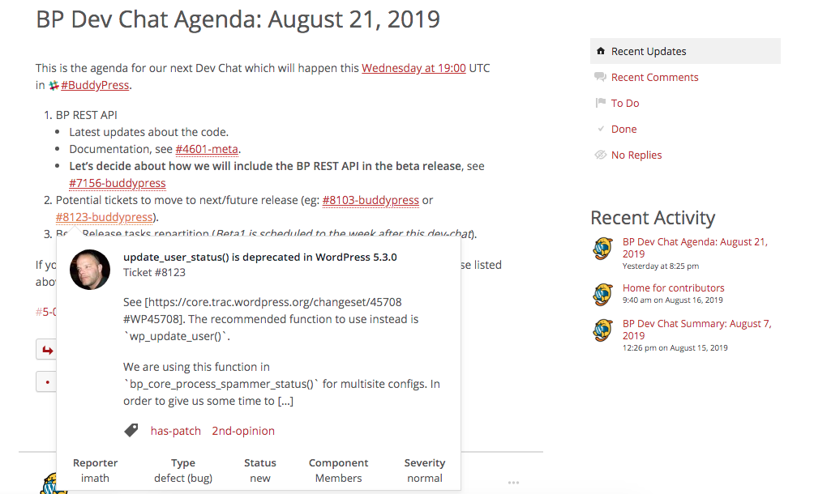

# o2 HoverCards

|    |
|               :---:              |
| Example of Trac Ticket hovercard |

o2 add-on to bring HoverCards to preview content of external services like Trac tickets or GitHub issues.

## Required configuration:

- WordPress 5.0.0,
- [o2](https://geto2.com/),
- [P2 Breathe](https://wpcom-themes.svn.automattic.com/p2-breathe/) theme or child theme.

## Setup

Download the `o2-hovercards.zip` file of the latest plugin version listed into this [releases page](https://github.com/imath/o2-hovercards/releases). From your WordPress Plugins Administration screen, click on the "Add" button to display the WordPress plugin uploading tool and browse to the place where you saved the zip file on your drive to upload it on your server. Once done, activate the plugin.

## Credits

Thanks [@betzster](https://profiles.wordpress.org/betzster/) for his great work on [p2-hovercards](https://github.com/Automattic/p2-hovercards).
The purpose of the o2-hovercards plugin is to adapt p2-hovercards for o2.

## Adding services

As the plugin comes with no added services, you will need to add some into a specific file located in the `/wp-content/mu-plugins` for example. You can get some inspiration from the [examples](https://github.com/Automattic/p2-hovercards/blob/master/examples.php) provided by the [p2-hovercards](https://github.com/Automattic/p2-hovercards) plugin.
